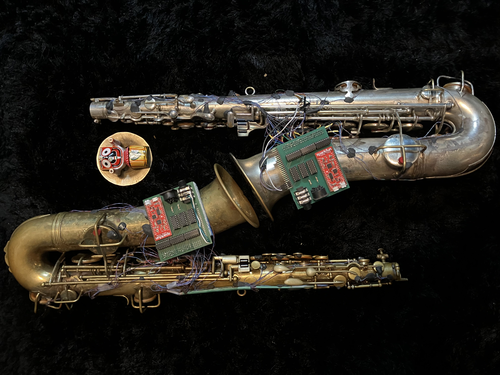

This was the subject of my PhD. in the Arts in 2023.

The project 'JAZZ HANDS' had 3 main goals: - The creation of a wireless MIDI system for saxophones without altering the natural sound of the instrument. - The creation of an original artistic work showcasing the system. - Learning new skills in soft- and hardware development for artistic endeavour.

The research resulted in the creation of a hybrid saxophone.
A 1927 Conn C-Melody saxophone was equipped with 21 sensors to output MIDI from the saxophone, effectively rendering the acoustic saxophone a true windcontroller, much like the Akai Ewi from the eighties.
The system is wired, wireless, battery powered and open source.

I made a complete build tutorial, including gerber files and code to upgrade your sax.

Here is the [DIY guide](https://www.instructables.com/Jazz-Hands-Hybrid-Saxophone/) on Instructables.com

You can check the repo [here](https://github.com/AndrewClaes/JazzHands)

You can see it in action [here](https://youtu.be/6yo2MiOfzPo?si=T2r9NxRX2XrAZ-x1)

And you can find a written journal of the process [here](../downloads/JAZZ HANDS - Open Hardware Hybrid Saxophone System.pdf)

I curated a concert at [KMSKA](https://kmska.be/nl/stuff) showcasing what I had learned and what I had made.

The concert was a 'mixdown' of all new possibilities I explored over the last 5 years.

In front of Hans Memling's 'God and the singing angels', the sax was showcased.

For this occasion, I worked together with Karel Goeyvaerts String Trio.
Utilising the Scoreflow software from BotBop's recent "Integers & Strings"
and featuring's dadamachines [automat](https://dadamachines.com) to trigger a drum kit, "hybrid open life" was conceived.

All this to recreate the MIDI data coming from the Hybrid Sax through carefully programmed musical algorithms, reacting on the incoming MIDI events in real time, pushed in four part harmony to the string trio + double bass ensemble with a delay of 8 musical bars.

It was truly a memorable day in my life.

But the story continues! Stay tuned for updates.

more [pics](../pages/projects-jazzhands-pics.html) here. 

Partners: <a href="https://www.uantwerpen.be/en/research-groups/aria/">ARIA</a>  <a href="https://www.uantwerpen.be/en/research-groups/idlab/">IDLAB</a> <a href="https://www.ap-arts.be/en/royal-conservatoire-antwerp">Royal Conservatory of Antwerp</a> <a href="https://www.uantwerpen.be/en/">University of Antwerp</a> <a href="https://kmska.be/nl/over-kmska">KMSKA</a>

Promotors:
[Kurt Van Herck](https://ap-arts.be/persoon/kurt-van-herck)
[Steven Latré](https://www.uantwerpen.be/nl/personeel/steven-latre/)

